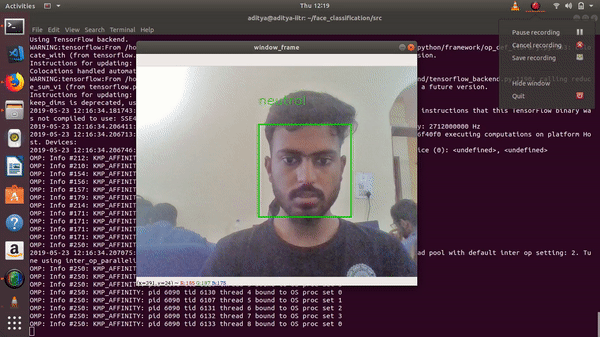

# Emotion-Detector
Emotion detection using harcascade model : OpenCV



## Run the code:
First update your environment with with REQUIREMENTS.txt file

Use : ``` pip3 intsall -f REQUIREMENTS.txt ```

Run the file with :``` python3 video_emotion_color_demo.py ```

To use external webcam in the code change
```video_capture = cv2.VideoCapture(0) : video_capture = cv2.VideoCapture(1)```
